# BOOK STORE WEB APPLICATION

<a href="https://github.com/fnkaya/spring-boot-book-store">Backend >>></a>

### USER PAGE

##### Home

 

##### Login/Register
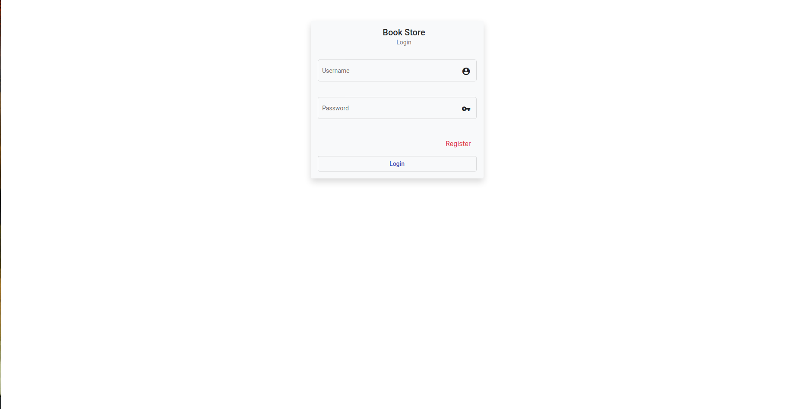
 

##### Product Details

 

##### Cart
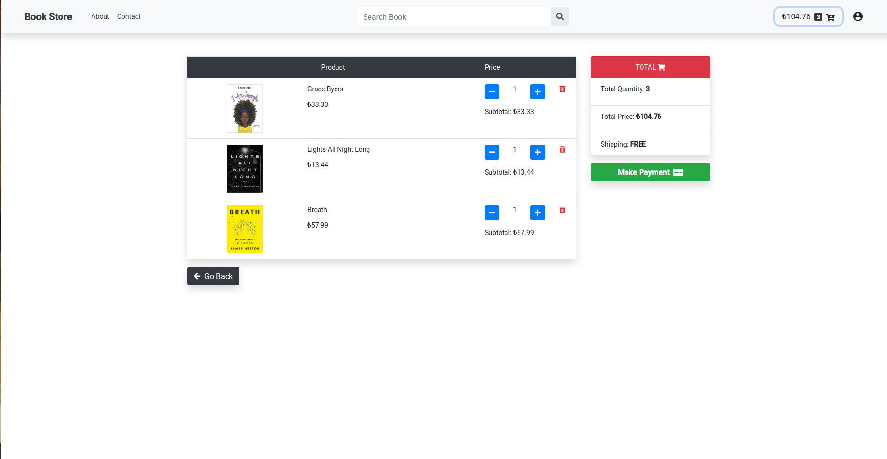
 

##### Payment
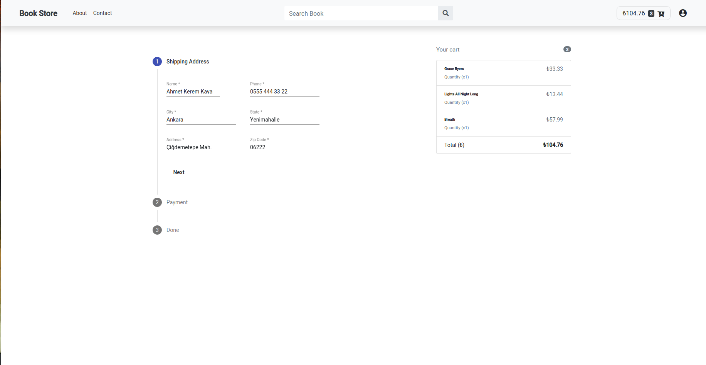
 

##### Orders

 
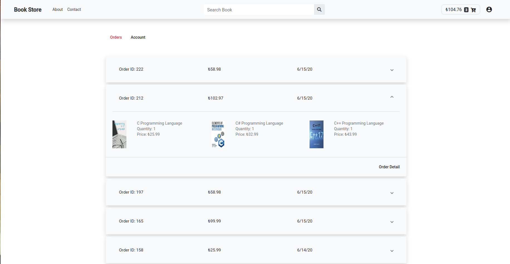
 

##### Order Details
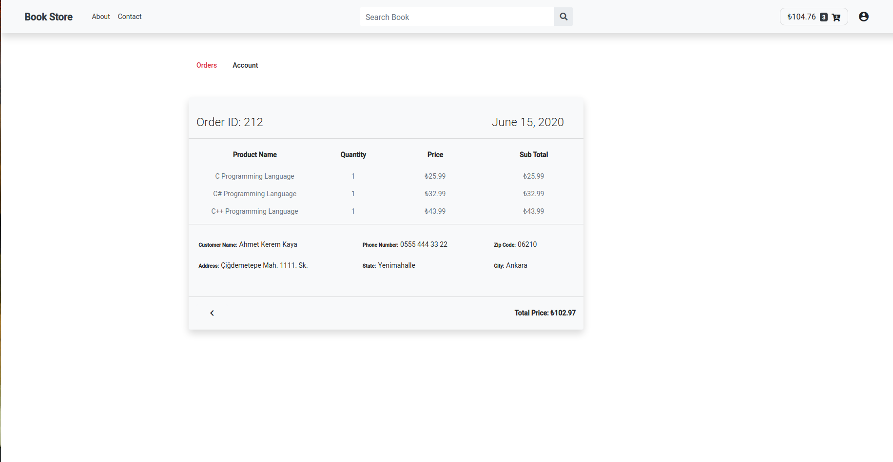
 

##### Account
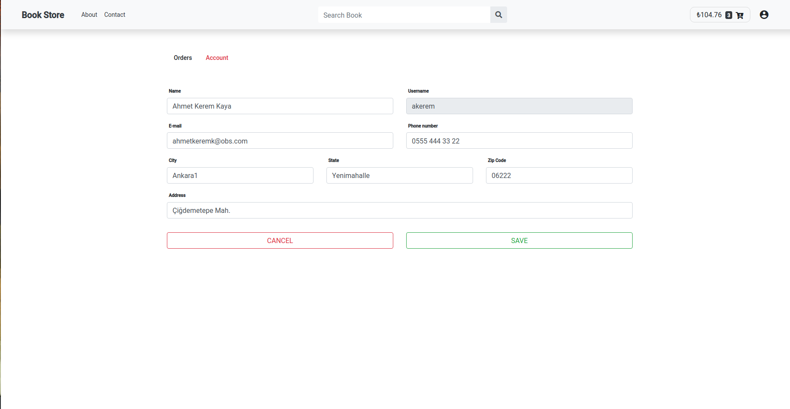
  

### ADMIN PAGE

##### Product Stock Info
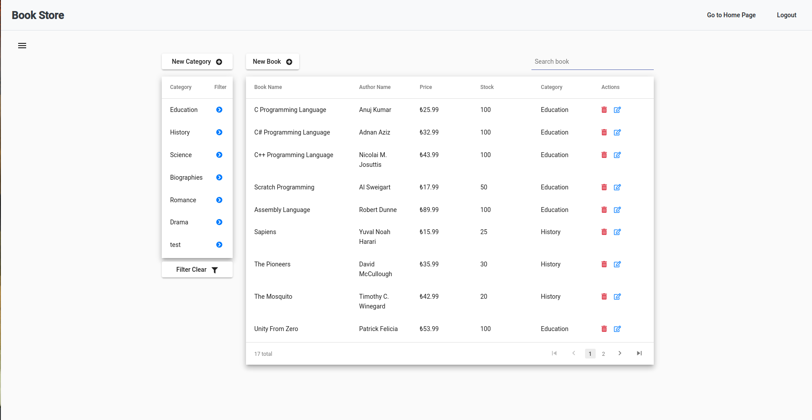
 

##### Inserting Book
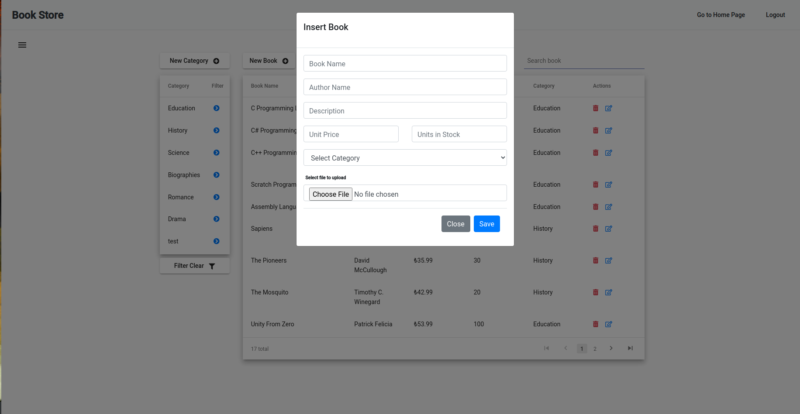
 

##### Updating Book Details
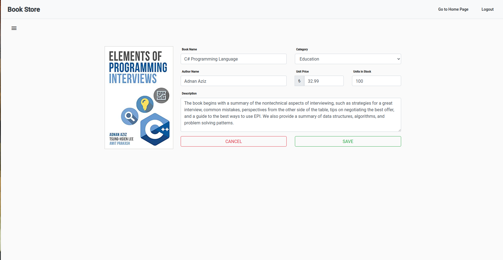
 

##### User List
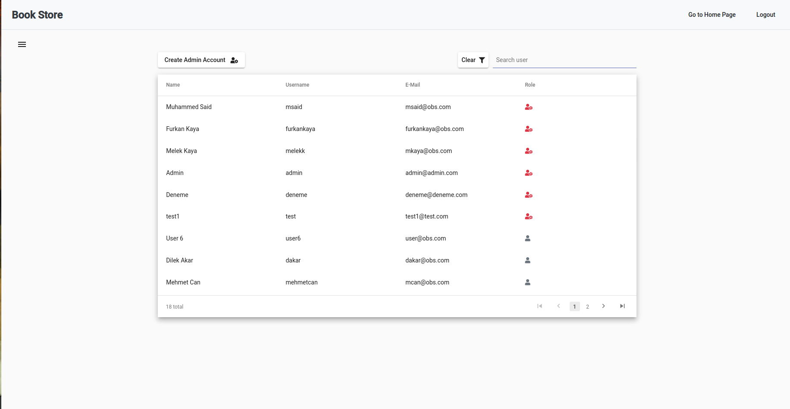
 

##### Creating Admin Account
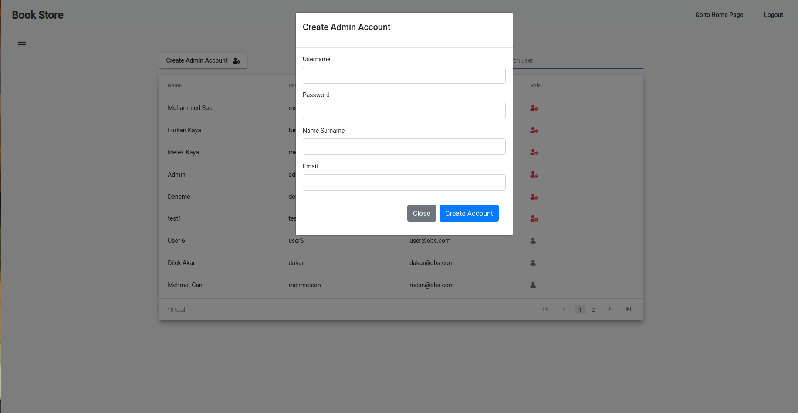
 

##### Order List
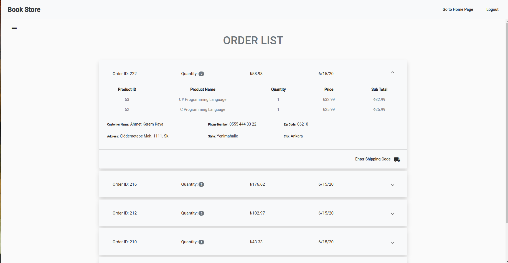
